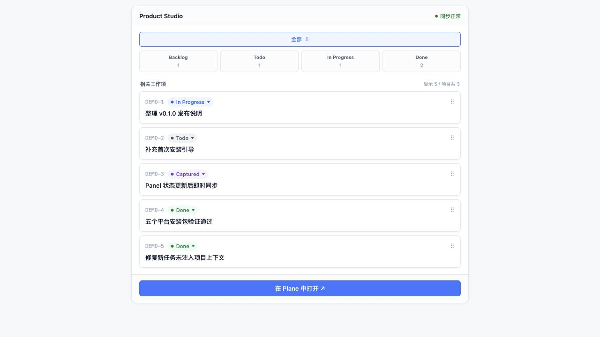

# Ambient Project Layer

让 Codex 在工作过程中安静地整理项目进展，并将任务、Bug、决定、风险和里程碑同步到 Plane。

[](LICENSE)
[](CHANGELOG.md)

Ambient Project Layer 是一个 Codex 插件。它从当前工作回合中捕获真正有项目价值的事件，先可靠写入本地 SQLite Outbox，再异步同步到 Plane。你可以继续在 Plane 中做完整的项目管理，也可以在 Codex 内通过轻量 Panel 查看最近工作项并修改状态。

它解决的是一个很具体的问题：开发工作已经在 Codex 中发生，但任务、决定和风险往往要靠人再次整理到项目管理工具中。Ambient Project Layer 把这段重复劳动压缩成一个安静、可审查的后台流程。

## 产品界面



Panel 默认展示最多 5 个相关工作项，支持按 Backlog、Todo、In Progress 和 Done 筛选，并可通过状态菜单或拖拽更新状态。完整创建、编辑、归档和项目管理仍在 Plane 中完成。

## 主要能力

- 自动识别任务、Bug、决定、想法、风险、里程碑、计划、进展和完成事件。
- 使用本地 SQLite Outbox 保证事件先落盘，再异步同步到 Plane。
- 首次进入项目目录时列出真实 Plane 项目，由用户明确选择绑定目标。
- 在 Codex 内提供轻量 Inline Panel，查看相关工作项、同步状态并跳转 Plane。
- 不保存完整对话、源码、终端输出或 Plane API Key。
- 每个平台的 Release 包自带 Node.js 22.22.1，无需用户另装 Node、pnpm 或 bun。

## 支持平台

从 [GitHub Releases](https://github.com/Bene-2020/plane-codex-mcp/releases/latest) 下载与机器匹配的压缩包：

| Release 目标 | 系统 | 架构 |
| --- | --- | --- |
| `darwin-arm64` | macOS | Apple Silicon |
| `darwin-x64` | macOS | Intel |
| `linux-x64` | Linux | x86_64 |
| `linux-arm64` | Linux | ARM64 / aarch64 |
| `win32-x64` | Windows | x86_64 |

不确定架构时，可在 macOS/Linux 运行 `uname -m`：`arm64` 或 `aarch64` 选择 ARM64，`x86_64` 选择 x64。当前不提供 Windows ARM64 安装包。

## 安装

### 1. 准备 Plane

你需要：

- 一个可访问的 Plane Cloud 或自托管实例；
- Workspace slug，例如 `https://app.plane.so/my-team/` 中的 `my-team`；
- 一个有目标项目读写权限的 Plane Personal Access Token。

Plane 官方文档说明了 [API Key 的创建位置与使用方式](https://developers.plane.so/api-reference/introduction)。请把 API Key 当作密码保管。

### 2. 安装对应平台的插件包

下载形如 `ambient-project-layer-v0.1.0-<target>.zip` 的资产，解压到不会随意移动的目录。下文用 `<RELEASE_DIR>` 表示解压后的绝对路径；该目录应直接包含 `.agents/plugins/marketplace.json`。

```bash
codex plugin marketplace add "<RELEASE_DIR>"
codex plugin add ambient-project-layer@ambient
codex plugin list
```

Codex 官方将插件定义为可安装的技能、MCP Server 和可选 UI 组合；本地开发或独立分发的插件通过 local marketplace 安装。可参考 [Build plugins](https://learn.chatgpt.com/docs/build-plugins)。

安装后，打开 Codex 的 Hook 管理界面，逐一复核并信任当前版本的以下 Hook：

- `SessionStart`
- `UserPromptSubmit`
- `PostToolUse`
- `Stop`
- `SessionEnd`

插件显示 `enabled` 不等于 Hook 已获得信任。安装或升级后如果 Hook 显示 `modified`，需要重新信任。

### 3. 配置 Plane 连接

正式插件不读取仓库或项目目录中的 `.env`。Plane 配置保存在用户级 `~/.codex/config.toml` 中，并由 Codex 启动 `ambient-project` MCP Server 时注入。

先新建一次 Codex task，让 Hook 创建插件数据目录。随后把 MCP 的 `AMBIENT_DB_PATH` 指向同一个 `PLUGIN_DATA/ambient.sqlite`：

- macOS/Linux：`$HOME/.codex/plugins/data/ambient-project-layer-ambient/ambient.sqlite`
- Windows：`%USERPROFILE%\.codex\plugins\data\ambient-project-layer-ambient\ambient.sqlite`

macOS/Linux 示例：

```bash
codex mcp add ambient-project \
  --env "AMBIENT_DB_PATH=$HOME/.codex/plugins/data/ambient-project-layer-ambient/ambient.sqlite" \
  --env "PLANE_MODE=sdk" \
  --env "PLANE_BASE_URL=https://api.plane.so" \
  --env "PLANE_WORKSPACE_SLUG=replace-with-your-workspace" \
  --env "PLANE_API_KEY=replace-in-config-toml" \
  -- "<RELEASE_DIR>/plugins/ambient-project-layer/runtime/bin/ambient-node" \
     "<RELEASE_DIR>/plugins/ambient-project-layer/runtime/mcp/index.js"
```

Windows PowerShell 示例：

```powershell
codex mcp add ambient-project `
  --env "AMBIENT_DB_PATH=$env:USERPROFILE\.codex\plugins\data\ambient-project-layer-ambient\ambient.sqlite" `
  --env "PLANE_MODE=sdk" `
  --env "PLANE_BASE_URL=https://api.plane.so" `
  --env "PLANE_WORKSPACE_SLUG=replace-with-your-workspace" `
  --env "PLANE_API_KEY=replace-in-config-toml" `
  -- "<RELEASE_DIR>\plugins\ambient-project-layer\runtime\bin\ambient-node.cmd" `
     "<RELEASE_DIR>\plugins\ambient-project-layer\runtime\mcp\index.js"
```

然后编辑 `~/.codex/config.toml`，仅在 `[mcp_servers.ambient-project.env]` 中把占位值替换为真实 Workspace slug 和 API Key。不要把真实 Key 放进上面的命令、仓库、Issue、日志或截图中，以免进入 shell history 或公开记录。

自托管 Plane 用户还需要把 `PLANE_BASE_URL` 换成实例的 API Base URL。

检查非敏感配置：

```bash
codex mcp get ambient-project
```

完成后完全退出并重新启动 Codex，再新建一个 task。已经运行的 MCP 进程不会自动读取修改后的配置。

## 第一次使用

1. 在一个真实项目目录中新建 Codex task。
2. Ambient Project Layer 会列出当前 Plane Workspace 中的项目并询问绑定目标。
3. 明确选择一个项目；插件不会根据目录名或 Git remote 自动猜测。
4. 继续正常使用 Codex。发生有意义的项目变化时，事件会先进入本地 Outbox，再同步到 Plane。
5. 对 Codex 说“打开项目面板”，即可查看相关工作项和同步状态。

如果暂时不想选择，可以回复“稍后再说”；本次 task 不会重复询问。如果明确要求某个目录以后不再询问，插件会只在本地保存这一偏好，之后也可以要求恢复绑定。

## 数据、权限与隐私

Ambient Project Layer 的数据边界如下：

| 数据 | 保存位置 | 说明 |
| --- | --- | --- |
| 工作项和项目状态 | Plane | 用户可见项目数据的最终来源 |
| 项目绑定、Outbox、精简缓存和 Hook 审计 | 本地 SQLite | 默认位于插件的 `PLUGIN_DATA` 目录 |
| Plane API Key | Codex 用户级配置与 MCP 进程内存 | 不写入 SQLite、Panel 或 Hook 输出 |
| Panel 临时令牌 | 当前 MCP 进程内存 | 每次进程启动重新生成 |

插件不会把完整 Codex transcript、源码、终端输出、附件或 API Key 保存到本地数据库，也不会把 Plane API Key 发送到浏览器 Panel。运行时对外只需要访问你配置的 Plane API。

插件需要 Plane 项目读写权限，用于读取项目与工作项、创建捕获到的工作项、写入进展评论和更新状态。它不提供自动删除、跨项目移动或人员分配工具。

## 升级

1. 从 Releases 下载同一平台的新版本，用新内容替换原来的稳定 Release 目录。
2. 从同一个 local marketplace 重新安装插件：

   ```bash
   codex plugin add ambient-project-layer@ambient
   ```

3. 确认 `ambient-project` MCP 仍指向稳定的 Release 目录和原有 SQLite 文件。
4. 在 Hook 管理界面重新复核并信任五个 Hook。
5. 完全退出并重启 Codex，再用新 task 验证绑定、同步和 Panel。

升级时不要删除或切换已有 SQLite 文件，否则本地绑定、Outbox 和来源引用不会自动迁移到新文件。

## 卸载

```bash
codex plugin remove ambient-project-layer@ambient
codex plugin marketplace remove ambient
codex mcp remove ambient-project
```

这些命令不会替你删除 Plane 中已经同步的工作项。若确定不再需要本地绑定和 Outbox，可在备份后手动删除对应的 `ambient.sqlite`；保留数据库不会影响 Plane 数据。

## 常见问题

### 插件已启用，但新 task 没有项目引导

先检查五个 Hook 是否已被当前版本信任。若显示未信任或 `modified`，重新信任并新建 task；已错过的 `SessionStart` 不会在旧 task 中补跑。

### `list_projects` 返回认证错误或没有项目

检查 `PLANE_MODE=sdk`、Base URL、Workspace slug、API Key 以及 Token 对目标 Workspace 的权限。修改配置后必须完全重启 Codex。

### MCP 工具正常，但 Panel 暂时不可用

重新调用“打开项目面板”。MCP 进程重启后，旧 Panel 的临时会话会失效；新调用会创建新的 Panel 会话。

### 工作项显示“待同步”

本地事件已经落盘，但 Plane 同步失败。检查网络、API Key 和 Plane 服务状态；恢复后 Outbox 会继续处理，不要通过删除 SQLite 来“重试”。

### 项目根目录为什么没有 `.env`？

正式插件使用 `~/.codex/config.toml`，不需要项目级 `.env`。只有从源码运行独立开发入口时才复制 `.env.example` 为 `.env`。

### 它会上传我的代码或完整对话吗？

不会。插件只记录经过归纳的项目事件、短来源摘录和同步所需元数据；不保存完整 transcript、源码或终端输出。

## 从源码构建

开发环境需要 Node.js 22、Corepack 和 Git。

```bash
git clone https://github.com/Bene-2020/plane-codex-mcp.git
cd plane-codex-mcp
corepack enable pnpm
pnpm install --frozen-lockfile
cp .env.example .env
pnpm test
pnpm lint
pnpm build
pnpm validate:plugin
pnpm smoke:plugin
```

`.env.example` 默认使用隔离的 `PLANE_MODE=fake`，适合本地测试。连接真实 Plane 时，请只在本地 `.env` 中填写凭据，不要提交 `.env`。

构建全部五个平台的插件目录：

```bash
pnpm run build:packages
pnpm run build:apps
pnpm package:plugin -- --all
node scripts/validate-plugin-runtime.mjs dist/plugins/ambient-project-layer --all
```

产物位于 `dist/plugins/ambient-project-layer/<target>/`。当前机器会真实执行本机架构的 sidecar；其他平台只做结构验证，最终 Release 还应在对应平台的 CI Runner 上完成原生 smoke test。

## 参与项目

- 提交代码前请阅读 [CONTRIBUTING.md](CONTRIBUTING.md)。
- 安全问题请按 [SECURITY.md](SECURITY.md) 私下报告，不要公开提交含漏洞细节的 Issue。
- 版本变化记录在 [CHANGELOG.md](CHANGELOG.md)。
- 第三方组件许可见 [THIRD_PARTY_NOTICES.md](THIRD_PARTY_NOTICES.md)。

## 许可证

Copyright © 2026 Wenyan Wei。

本项目使用 [MIT License](LICENSE)。
