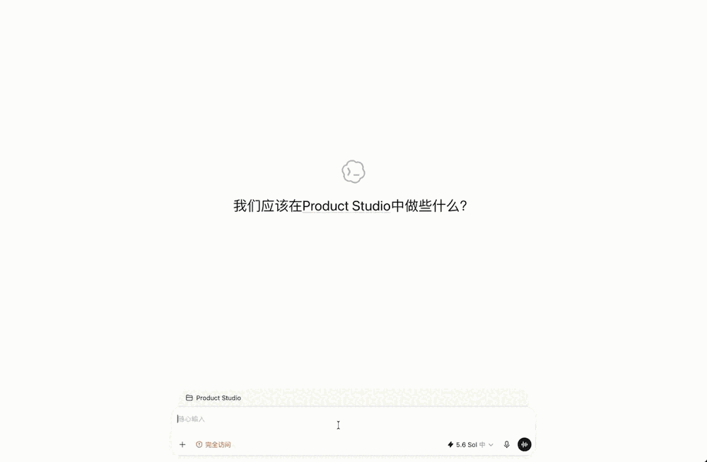

# Ambient Project Layer

[中文](README.md) | English

Let Codex quietly organize project progress while you work and synchronize tasks, bugs, decisions, risks, and milestones to Plane.

[Plane](https://plane.so/open-source) is an open-source project management platform licensed under AGPL-3.0. You can self-host its Community Edition for free or use its free cloud plan. The self-hosted Community Edition has no user limit, while the Cloud Free plan currently supports up to 12 users, making Plane a strong fit for individual developers, one-person companies, and small teams. See the [official Plane pricing page](https://plane.so/pricing) for current limits.

[](LICENSE)
[](CHANGELOG.md)

Ambient Project Layer is a Codex plugin. It captures project-relevant events from the current work turn, writes them reliably to a local SQLite Outbox, and then synchronizes them asynchronously to Plane. You can continue using Plane for full project management while viewing recent work items and changing their status through a lightweight Panel inside Codex.

It addresses a specific problem: development work already happens in Codex, but tasks, decisions, and risks often need to be manually organized again in a project management tool. Ambient Project Layer turns that duplicate effort into a quiet, reviewable background workflow.

## Product interface



The Panel shows up to five relevant work items by default. It supports Backlog, Todo, In Progress, and Done filters, and lets you update status through a menu or drag and drop. Full creation, editing, archiving, and project management remain in Plane.

The Panel UI directly follows the visual style of Plane's open-source product, including its colors, status labels, card hierarchy, and interaction patterns, so users get a consistent experience between Codex and Plane. This interface is implemented by this project; it is not an official Plane component and does not imply endorsement by Plane.

## Key capabilities

- Recognizes tasks, bugs, decisions, ideas, risks, milestones, plans, progress updates, and completion events.
- Uses a local SQLite Outbox so events are persisted before asynchronous Plane synchronization.
- Lists real Plane projects when a project directory is first opened and asks the user to choose an explicit binding.
- Provides a lightweight Inline Panel in Codex to view relevant work items, synchronization health, and Plane links.
- Does not store full conversations, source code, terminal output, or the Plane API Key.
- Bundles Node.js 22.22.1 in every platform Release package, so users do not need to install Node, pnpm, or bun.

## Supported platforms

Download the archive matching your machine from [GitHub Releases](https://github.com/Bene-2020/plane-codex-mcp/releases/latest):

| Release target | Operating system | Architecture |
| --- | --- | --- |
| `darwin-arm64` | macOS | Apple Silicon |
| `darwin-x64` | macOS | Intel |
| `linux-x64` | Linux | x86_64 |
| `linux-arm64` | Linux | ARM64 / aarch64 |
| `win32-x64` | Windows | x86_64 |

If you are unsure about your architecture, run `uname -m` on macOS or Linux: choose ARM64 for `arm64` or `aarch64`, and x64 for `x86_64`. Windows ARM64 packages are not currently provided.

## Installation

### 1. Prepare Plane

You need:

- an accessible Plane Cloud or self-hosted instance;
- a Workspace slug, such as `my-team` in `https://app.plane.so/my-team/`;
- a Plane Personal Access Token with read and write access to the target project.

The Plane documentation explains [where to create an API Key and how to use it](https://developers.plane.so/api-reference/introduction). Treat the API Key as a password.

### 2. Install the package for your platform

Download an asset named like `ambient-project-layer-v0.1.1-<target>.zip` and extract it to a stable directory. The instructions below refer to its absolute path as `<RELEASE_DIR>`. This directory should directly contain `.agents/plugins/marketplace.json`.

```bash
codex plugin marketplace add "<RELEASE_DIR>"
codex plugin add ambient-project-layer@ambient
codex plugin list
```

OpenAI defines a plugin as an installable combination of skills, an MCP Server, and optional UI. Plugins distributed independently or developed locally can be installed from a local marketplace. See [Build plugins](https://learn.chatgpt.com/docs/build-plugins).

After installation, open the Hook management screen in Codex and review and trust each Hook for the installed version:

- `SessionStart`
- `UserPromptSubmit`
- `PostToolUse`
- `Stop`
- `SessionEnd`

A plugin being shown as `enabled` does not mean its Hooks are trusted. If a Hook is marked `modified` after installation or an upgrade, trust it again.

### 3. Configure the Plane connection

The production plugin does not read `.env` from the repository or project directory. Plane configuration is stored in the user-level `~/.codex/config.toml` file and injected when Codex starts the `ambient-project` MCP Server.

Create a Codex task once so the Hook can create the plugin data directory. Then point the MCP `AMBIENT_DB_PATH` to the same `PLUGIN_DATA/ambient.sqlite` file:

- macOS/Linux: `$HOME/.codex/plugins/data/ambient-project-layer-ambient/ambient.sqlite`
- Windows: `%USERPROFILE%\.codex\plugins\data\ambient-project-layer-ambient\ambient.sqlite`

macOS/Linux example:

```bash
codex mcp add ambient-project \
  --env "AMBIENT_DB_PATH=$HOME/.codex/plugins/data/ambient-project-layer-ambient/ambient.sqlite" \
  --env "PLANE_MODE=sdk" \
  --env "PLANE_BASE_URL=https://api.plane.so" \
  --env "PLANE_WORKSPACE_SLUG=replace-with-your-workspace" \
  --env "PLANE_API_KEY=replace-in-config-toml" \
  -- "<RELEASE_DIR>/plugins/ambient-project-layer/runtime/bin/ambient-node" \
     "<RELEASE_DIR>/plugins/ambient-project-layer/runtime/mcp/index.js"
```

Windows PowerShell example:

```powershell
codex mcp add ambient-project `
  --env "AMBIENT_DB_PATH=$env:USERPROFILE\.codex\plugins\data\ambient-project-layer-ambient\ambient.sqlite" `
  --env "PLANE_MODE=sdk" `
  --env "PLANE_BASE_URL=https://api.plane.so" `
  --env "PLANE_WORKSPACE_SLUG=replace-with-your-workspace" `
  --env "PLANE_API_KEY=replace-in-config-toml" `
  -- "<RELEASE_DIR>\plugins\ambient-project-layer\runtime\bin\ambient-node.cmd" `
     "<RELEASE_DIR>\plugins\ambient-project-layer\runtime\mcp\index.js"
```

Then edit `~/.codex/config.toml` and replace the placeholder Workspace slug and API Key only under `[mcp_servers.ambient-project.env]`. Do not put a real Key in the commands above, a repository, an Issue, logs, or screenshots, where it could enter shell history or public records.

Self-hosted Plane users must also replace `PLANE_BASE_URL` with their instance's API Base URL.

Inspect the MCP configuration locally:

```bash
codex mcp get ambient-project
```

This command may display the Plane API Key. Do not paste its output into an Issue, log, chat, or screenshot. Share only content from which credentials have been removed.

Completely quit and restart Codex, then create a new task. An already running MCP process will not automatically load the updated configuration.

## First use

1. Create a Codex task in a real project directory.
2. Ambient Project Layer lists projects in the current Plane Workspace and asks which one to bind.
3. Explicitly select a project. The plugin does not guess based on the directory name or Git remote.
4. Continue working normally in Codex. Meaningful project changes enter the local Outbox before being synchronized to Plane.
5. Ask Codex to "open the project panel" to view relevant work items and synchronization status.

If you do not want to choose yet, reply "later"; the current task will not ask again. If you explicitly ask a directory never to prompt again, the plugin stores that preference only locally. You can ask to restore binding later.

Ambient Plane binding uses only the real return from the host tool `mcp__ambient_project__list_projects` in the current turn. `codex_app__list_projects` remains available for explicit Codex Projects requests, but it must never be used as Plane binding evidence. Each binding bullet must use an exact `identifier | name` pair (the fields may be individually wrapped in Markdown bold, underscore-bold, or inline code); prefixes, suffixes, extra fields, `path`, `projectKind`, `hostId`, and local project names are rejected.

## Data, permissions, and privacy

Ambient Project Layer has the following data boundaries:

| Data | Storage location | Notes |
| --- | --- | --- |
| Work items and project status | Plane | Final source of user-visible project data |
| Project bindings, Outbox, compact cache, and Hook audit | Local SQLite | Stored in the plugin `PLUGIN_DATA` directory by default |
| Plane API Key | User-level Codex configuration and MCP process memory | Not written to SQLite, the Panel, or Hook output |
| Panel temporary token | Current MCP process memory | Regenerated every time the process starts |

The plugin does not store full Codex transcripts, source code, terminal output, attachments, or API Keys in the local database, and it does not send the Plane API Key to the browser Panel. At runtime, its only required external access is to the configured Plane API.

The plugin requires Plane project read and write access to read projects and work items, create captured work items, add progress comments, and update status. It does not expose tools for automatic deletion, cross-project moves, or assigning people.

## Upgrading

1. Download the new version for the same platform from Releases and replace the contents of your stable Release directory.
2. Reinstall the plugin from the same local marketplace:

   ```bash
   codex plugin add ambient-project-layer@ambient
   ```

3. Confirm that the `ambient-project` MCP configuration still points to the stable Release directory and the original SQLite file.
4. Review and trust the five Hooks again in the Hook management screen.
5. Completely quit and restart Codex, then verify binding, synchronization, and the Panel in a new task.

Do not delete or switch the existing SQLite file while upgrading. Local bindings, Outbox data, and source references are not automatically migrated to a different file.

## Uninstalling

```bash
codex plugin remove ambient-project-layer@ambient
codex plugin marketplace remove ambient
codex mcp remove ambient-project
```

These commands do not remove work items already synchronized to Plane. If you no longer need the local bindings and Outbox, back up and then manually delete the corresponding `ambient.sqlite`. Keeping the database does not affect Plane data.

## FAQ

### The plugin is enabled, but a new task does not show project onboarding

First check whether the installed version's five Hooks are trusted. If they are untrusted or marked `modified`, trust them again and create a new task. A `SessionStart` missed earlier is not replayed in an existing task.

### `mcp__ambient_project__list_projects` returns an authentication error or no projects

Check `PLANE_MODE=sdk`, the Base URL, Workspace slug, API Key, and the Token's permissions for the target Workspace. Completely restart Codex after changing the configuration.

### MCP tools work, but the Panel is temporarily unavailable

Ask to open the project panel again. Restarting the MCP process invalidates the previous Panel session; a new call creates a new one.

### A work item shows "pending synchronization"

The local event is already persisted, but Plane synchronization failed. Check the network, API Key, and Plane service status. The Outbox will continue processing after recovery; do not delete SQLite to "retry."

### Why is there no `.env` in the project root?

The production plugin uses `~/.codex/config.toml` and does not need a project-level `.env`. Copy `.env.example` to `.env` only when running the standalone development entry points from source.

### Does it upload my code or full conversations?

No. The plugin records only summarized project events, short source excerpts, and synchronization metadata. It does not store full transcripts, source code, or terminal output.

## Building from source

The development environment requires Node.js 22, Corepack, and Git.

```bash
git clone https://github.com/Bene-2020/plane-codex-mcp.git
cd plane-codex-mcp
corepack enable pnpm
pnpm install --frozen-lockfile
cp .env.example .env
pnpm test
pnpm lint
pnpm build
pnpm validate:plugin
pnpm smoke:plugin
```

`.env.example` uses isolated `PLANE_MODE=fake` by default and is suitable for local testing. To connect to a real Plane instance, enter credentials only in your local `.env` and never commit that file.

Build plugin directories for all five platforms:

```bash
pnpm run build:packages
pnpm run build:apps
pnpm package:plugin -- --all
node scripts/validate-plugin-runtime.mjs dist/plugins/ambient-project-layer --all
```

Artifacts are written to `dist/plugins/ambient-project-layer/<target>/`. The current machine executes the sidecar for its own architecture; packages for other platforms receive structural validation only. Final Release packages should still run native smoke tests on the corresponding CI Runner.

## Contributing

- Read [CONTRIBUTING.md](CONTRIBUTING.md) before submitting code.
- Report security problems privately according to [SECURITY.md](SECURITY.md); do not open a public Issue containing vulnerability details.
- Version changes are documented in [CHANGELOG.md](CHANGELOG.md).
- Third-party component licenses are listed in [THIRD_PARTY_NOTICES.md](THIRD_PARTY_NOTICES.md).

## License

Copyright © 2026 Wenyan Wei.

This project is licensed under the [MIT License](LICENSE).
